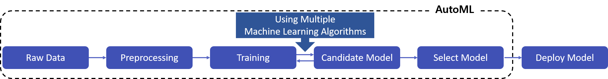
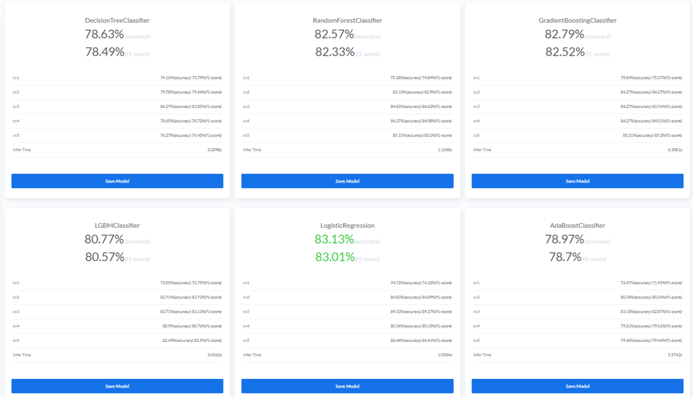
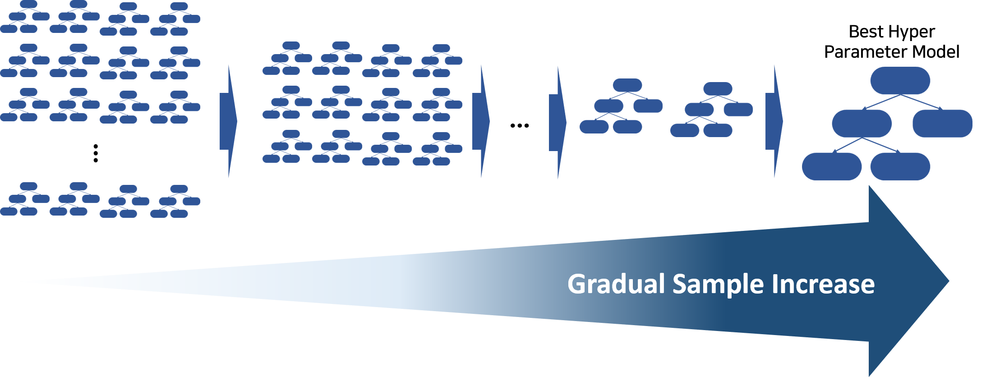

# AutoML
Machine Learning 알고리즘을 적용한 인공지능 모델을 개발하고 운영에 활용하기 위해서는 데이터 수집, 전처리, 모델 학습 및 검증과 같은 많은 과정을 거쳐야합니다. 이러한 과정을 거치기 위해서는 분석 전문가의
많은 시간과 노력이 필요합니다. <B>AutoML 기능을 활용하면 반복되는 분석과정을 자동화하여 효율을 높일 수 있습니다.</B> 또한, 데이터 분석에 대한 지식이 부족한 비전문가도 AutoML을 활용하여 <B>손쉽게 문제 해결을 위한 인공지능 모델을 학습</B>할 수 있습니다.
  

### Auto Modeling
* BADA의 [Auto Model Select](/AutoModelSelect/) 는 데이터 분석 사이클을 Auto ML로 대체하며 다양한 Machine Learning 알고리즘이 적용된 모델별 성능을 리포팅하여 사용자가 우수한 모델을 선택할 수 있도록 지원합니다.
  

* 현재 BADA Demo 에서 지원하는 AutoML은 Tabular Data(표 형태, 정형)를 대상으로 지원하고 있으며 분석 모듈을 추가함에 따라 Image, Text Data 에 대한 AutoML 기능도 확장할 수 있습니다.

## Auto Hyper Parameters Tuning
* BADA의 [Auto Params Tuning](/AutoModelTuning/) 은 Machine Learning 알고리즘의 다양한 Hyper Parameters 를 조정하여 최적의 성능을 낼 수 있도록 합니다.
* 다양한 Hyper Parameters 값들로 부터 최적의 조합을 찾기위해 Gradual Grid Search 와 베이지안 최적화(Bayesian Optimize) 를 적용합니다.

### Gradual Grid Search
 

* 모델 내 다양한 Hyper Parameter 의 가능한 조합 집합을 정의하고 제일 우수한 성능의 조합을 찾는 방법이 Grid Search  입니다.
* Grid Search 는 단순하면서 좋은 Hyper Parameter 조합을 찾을 수 있으나 탐색 많은 시간이 소요됩니다.
* BADA는 Gradual Grid Search 를 적용하여 <B>Hyper Parameter 최적화 탐색 시간을 개선</B>하였습니다.
* 관심있는 Hyper Parameter 조합 집합을 정의하고 고려되는 factor 수에 따른 최소 데이터 샘플 수에서 수를 점점 늘려가며 모델링을 수행합니다.
* 위 과정에서 worst 한 Hyper Parameter 조합을 점차 제거하고 최적의 Hyper Parameter 조합을 찾을 수 있습니다.

### 베이지안 최적화(Bayesian Optimize)

* 베이지안 최적화는 특정 입력 값 <i><b>x</b></i>에 의한 미지의 목적 함수 <i><b>f(x)</b></i> 를 정하고 그 함숫값인 <i><b>f(x)</b></i>가 최대 또는 최소가 되게하는 최적해를 찾는 방법입니다.
* 베이지안 최적화는 <B>Surrogate Model</B> 과 <b>Acquisition Function</b> 구성되어 있습니다.
* <B>Surrogate Model</B>는 입력 값 샘플 및 함숫값의 집합으로 목적함수의 형태를 추정하는 모델입니다.
* <b>Acquisition Function</b>는 Surrogate Model 확률 추정 과정 중 현재까지 추정 결과를 바탕으로 최적 입력 찾는데 유용한 다음 입력 값 후보를 추천해주는 함수 입니다.
  

&nbsp; &nbsp;  사진출처 : [https://github.com/fmfn/BayesianOptimization](https://github.com/fmfn/BayesianOptimization) 
 
    * 수행 과정 그림을 통해서 파란색 실제 목적함수를 찾기위해 검은 점선으로 점차 추정하는 과정을 확인할 수 있습니다.
    * 보라색 선이 Acquisition Function 으로 다음 입력 후보를 어떤 값을 사용할지 추천해주고 있습니다.
* Hyper Parameters Tuning 기준 베이지안 최적화는 특정 입력 값 <i>x</i>는 여러 Hyper Parameter 이며, 목적함수 <i><b>f(x)</b></i>는 학습 모델의 검증 데이터셋에 대한 성능입니다.
* 베이지안 최적화는 Grid 또는 Random Search 에서 활용하지 않는 모델 성능 목적함수의 분포를 추정함으로써 좋은 성능을 가진 Hyper Parameter 를 찾는데 효율적입니다.
* BADA 는 <B>베이지안 최적화를 적용하여 Hyper Parameter Tuning 과정 모델의 일반화 성능을 극대화</B> 합니다.
