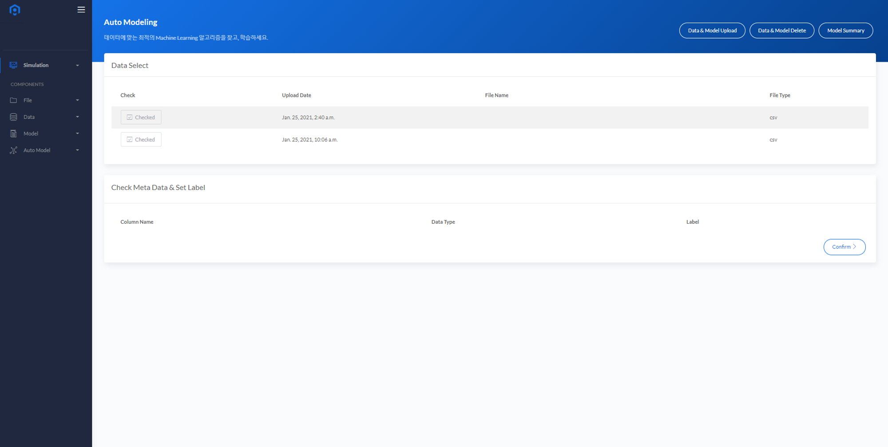
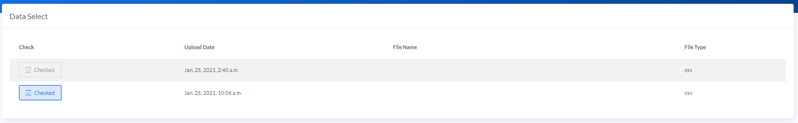
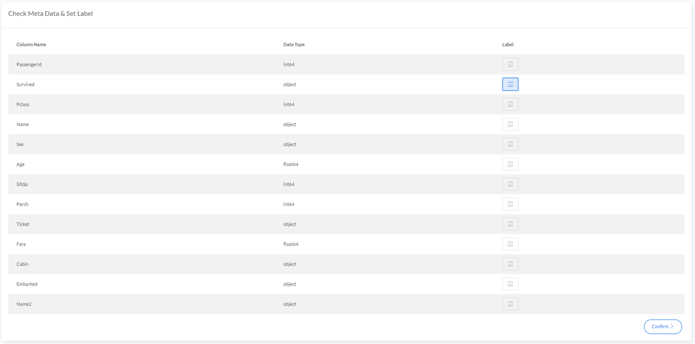
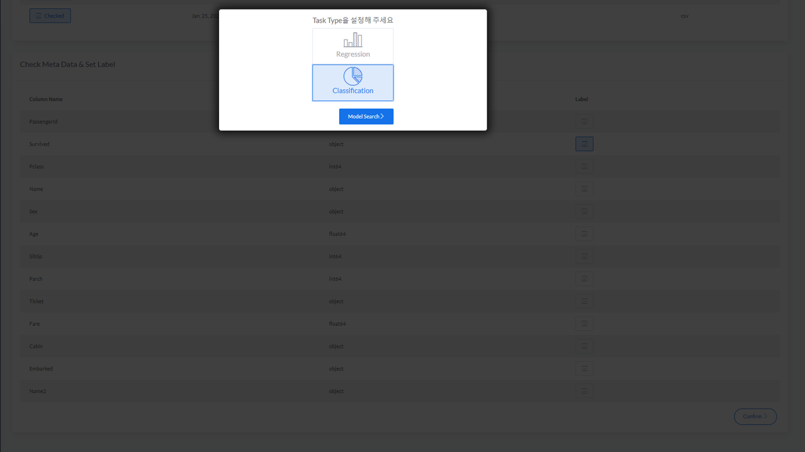
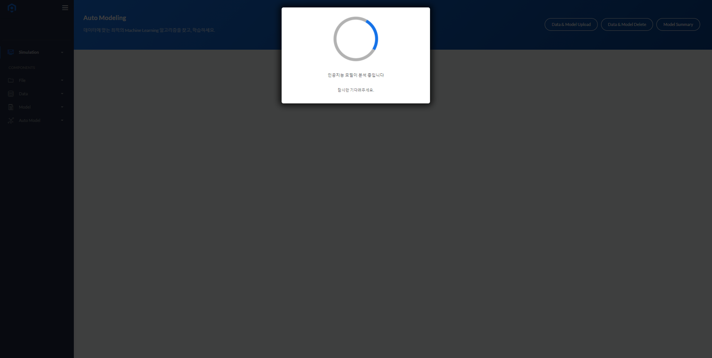
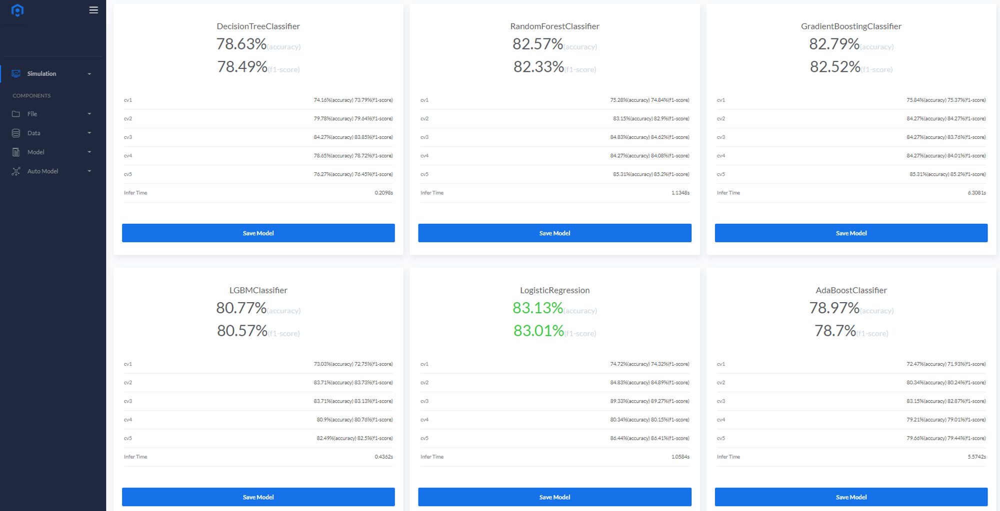
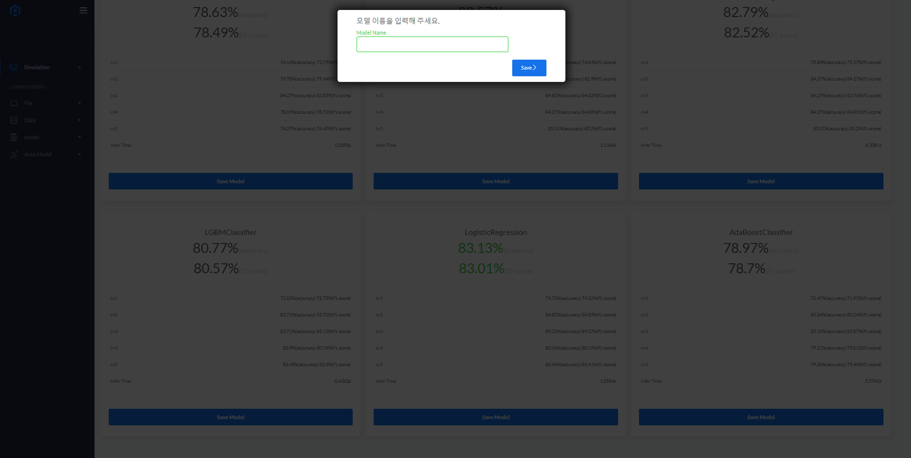

# Auto Model Select
사용자가 수행할 데이터 분석 Task의 형태에 따라 여러 Machine Learning 알고리즘으로 모델링을 수행하고 저장합니다.
  

## Auto Modeling
* <B>Data Select</B>에서 업로드 된 데이터 파일들 중에서 Auto Modeling을 수행할 파일을 체크박스 형태로 선택합니다.
  

* 데이터에 대해 선택이 완료된 경우 <B>Check Meta Data & Set Label</B> 메타 정보를 확인하고 목표변수(Label)을 선택하여야 합니다.
  

<B>Note:</B> 데이터 메타 정보에 대한 수정이 필요할 경우 <B>Edit Meta</B> 버튼을 누르거나 <B>[MetaData](/MetaData/)</B>메뉴에서 수정할 수 있습니다.

* 하나의 목표변수를 선택이 완료된 경우 <B>Confim</B> 버튼을 누르고 Regression 또는 Classification 중 하나의 Task Type을 선택합니다.
  

* Task Type은 선택 후<B>Model Search</B>를 누르면 Auto Model 과정이 시작되며 완료된 경우 사용된 Machine Learning 알고리즘의 종류와 성능을 확인할 수 있습니다.
  

* 각 모델별로 학습에 사용된 데이터에 대한 5겹 교차검증 결과와 추론시간을 함께 제공하며 성능이 가장 우수한 알고리즘이 강조 표시됩니다.
  

* 사용자는 모델별 성능을 확인하고 채택할 모델에 대해서 <B>Saved Model</B> 버튼을 눌러 저장할 수 있으며 파일 이름을 수정하여 저장할 수 있습니다.
  

  
<B>Note : </B> Auto Modeling을 통해 저장된 모델을 [Auto Params Tuning](/AutoModelTuning/)에서 하이퍼 파라미터 튜닝을 수행할 수 있습니다.
