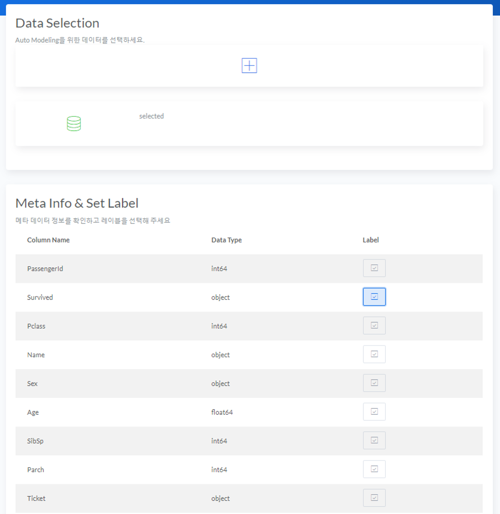

# Auto Params Tuning
Auto Model Select 에서 저장한 모델 또는 Python scikit-learn을 통해 학습한 모델의 하이퍼 파라미터를 최적화하여 성능을 높일 수 있는 기능입니다.
  

## Parameters Tuning
* <B>Data Selection</B>에서 업로드 된 데이터 파일들 중에서 Parameters Tuning 을 수행할 파일을 체크박스 형태로 선택합니다.
  

  

* 데이터에 대해 선택이 완료된 경우 <B>Check Meta Data & Set Label</B> 메타 정보를 확인하고 목표변수(Label)을 선택하여야 합니다.
  

* <B>Model Selection</B>에서 업로드 된 모델 파일들 중에서 Parameters Tuning 을 수행할 파일을 체크박스 형태로 선택합니다.
  

  

* 모델에 대해 선택이 완료된 경우 <B>Model Summary</B> Parameters Tuning 전 모델 요약정보를 확인할 수 있습니다.
  

* 데이터, 라벨 및 모델 파일 선택이 완료된 후 <B>Parameters Tuning Start</B> 버튼을 누르고 저장 할 모델 파일이름을 기입하면 Auto Tuning 이 시작됩니다.
  

  

  
<B>Note : </B> Paramters Tuning에 관한 자세한 기술 내용은 [Auto Hyper Parameters Tuning](/AutoML/#auto-hyper-parameters-tuning) 에서 확인할 수 있습니다.

* Parameters Tuning 이 완료되면 자동으로 모델이 저장되고 Tuning 전 후 Parameters 및 모델 성능을 비교할 수 있습니다.
  

