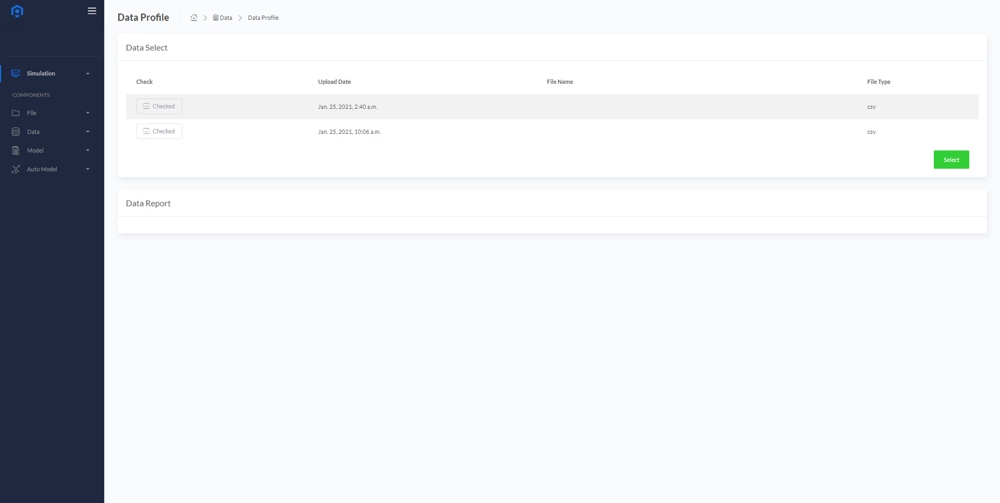
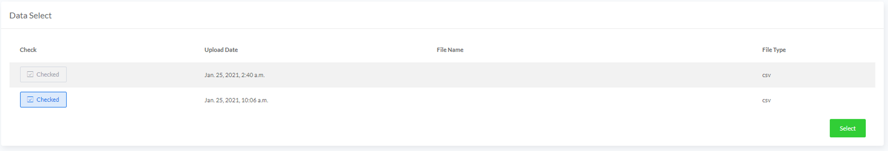
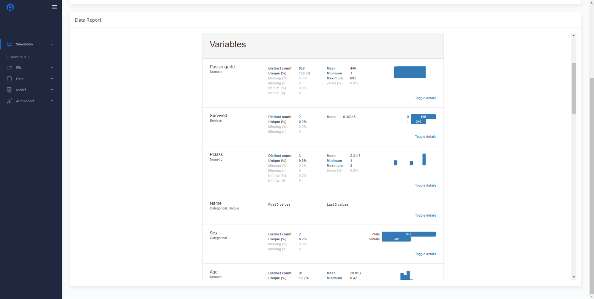
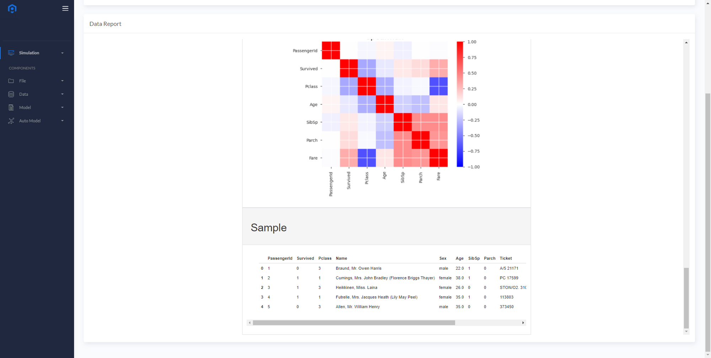

# Data Profile
사용자가 업로드 한 데이터에 대해서 간단히 탐색하고 리포팅하는 기능입니다.
  

### Data Report
* <B>Data Select</B>에서 업로드 된 데이터 파일들 중에서 데이터 프로파일을 확인할 파일을 체크박스 형태로 선택합니다.
* 선택한 데이터를 확인하고 <B>Select</B> 버튼을 누르면 <B>Data Report</B>에서 데이터 프로파일을 확인할 수 있습니다.
  

* 데이터 내 각 변수들의 기본 통계량, 분포, 상관관계 등을 확인 할 수 있습니다.
  

  

