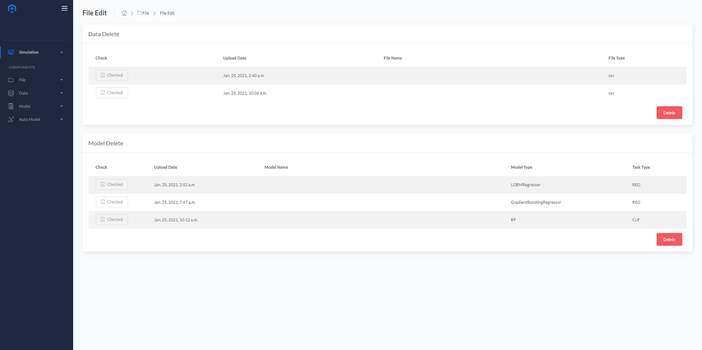
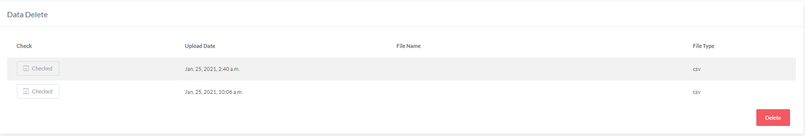
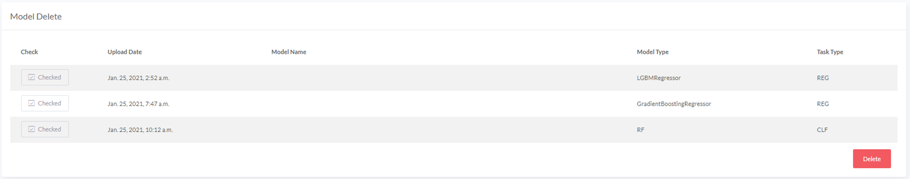
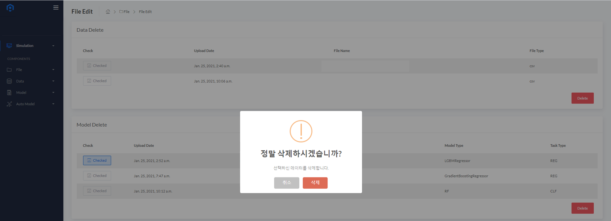
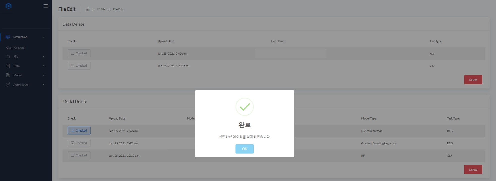

# File Edit
사용자가 업로드 한 데이터 또는 모델 파일을 확인하고 삭제 할 수 있습니다.
  

### Data Delete
  

* 지금까지 업로드 한 데이터 파일의 목록을 확인할 수 있습니다.
* 삭제를 원하는 데이터 파일을 체크박스로 선택후 <B>Delete</B> 버튼을 눌러 삭제 할 수 있습니다.

### Model Delete
  

* 지금까지 업로드 한 모델 파일의 목록을 확인할 수 있습니다.
* 삭제를 원하는 모델 파일을 체크박스로 선택후 <B>Delete</B> 버튼을 눌러 삭제 할 수 있습니다.

  

  

