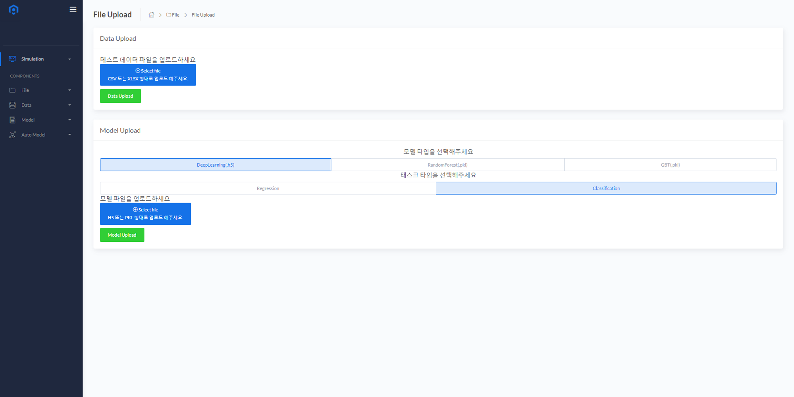

# File Upload
데이터 파일과 모델 파일을 업로드 할 수 있는 기능입니다.
  

### Data Upload
* 분석에 사용할 데이터 또는 모델 학습에 사용했던 데이터를 업로드 합니다.

* 파일을 DropDown 형태로 넣거나 Select file 버튼을 눌러 업로드할 파일을 선택합니다.
  

  
* 업로드할 파일이 선택이 완료된 후 Data Upload 버튼을 눌러 업로드를 진행합니다.
  

<B>Note:</B> csv 또는 xlsx 형태의 데이터만 업로드 할 수 있습니다.

### Model Upload
* Python 라이브러리 Scikit-learn 또는 Keras 를 통해 학습 된 모델 파일을 업로드 합니다.
* 파일을 DropDown 형태로 넣거나 Select file 버튼을 눌러 업로드할 파일을 선택합니다.
* 학습된 모델의 Task Type에 따라 회귀(Regression) 또는 분류(Classification)를 선택합니다.
  

* 업로드할 파일이 선택이 완료된 후 Data Upload 버튼을 눌러 업로드를 진행합니다.
  

<B>Note:</B> h5 또는 pkl 형식의 파일만 업로드 할 수 있습니다.