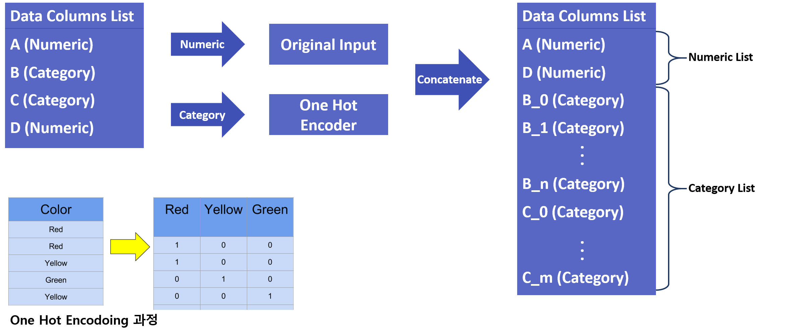

# Input Data Processing
BADA Auto Model 기능을 사용하지 않고 Python 라이브러리로 학습한 모델과 데이터 셋을 활용하여 [Simulation & Optimization](/simulation/) 를 적용할 때 데이터를 어떻게 처리해서 모델 입력을 구성하는지를 나타냅니다.
  

* 숫자(Numeric) 변수는 별다른 처리 과정 없이 그대로 사용됩니다.
* 범주(Category) 변수는 One Hot Encoding 과정을 거쳐 숫자로 변환 후 입력됩니다.
* Simulation & Optimization 과정 중 모델에 입력되는 데이터 내 변수 순서는 위와 같이 <B>Numeric 형태 변수는 앞으로 One Hot Encoding 이 적용된 Category 형태 변수는 뒤로 재배치</B> 됩니다.

