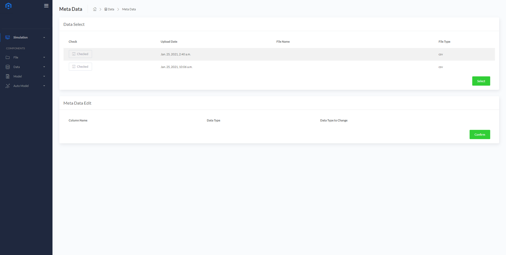

# Meta Data
업로드 한 데이터에 대한 메타 정보를 확인하고 수정할 수 있는 기능입니다.
  

### Meta Data Edit
* <B>Data Select</B>에서 업로드 된 데이터 파일들 중에서 메타 정보를 확인할 파일을 체크박스 형태로 선택합니다.
  

* 선택한 데이터 파일을 확인하고 <B>Select</B> 버튼을 누르면 <B>Meta Data Edit</B>에서 메타 정보를 확인할 수 있습니다.
  

* 데이터 내 각 변수들의 Type을 확인하고 원하는 Type 으로 수정할 수 있습니다.
* 변수들의 Type는 Object(문자형), Int(정수형), Float(실수형) 중 하나로 선택할 수 있습니다.
* 데이터에 대한 메타 정보를 수정이 완료된 경우 <B>Confirm</B> 버튼을 눌러 업데이트 할 수 있습니다.
  

