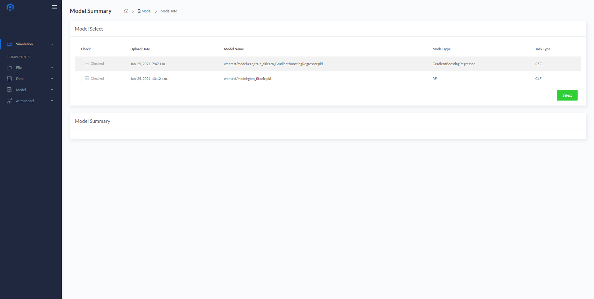
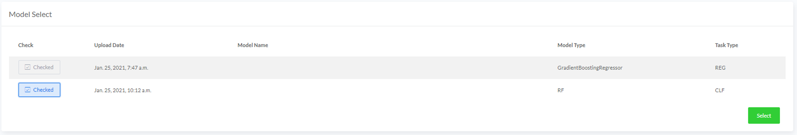
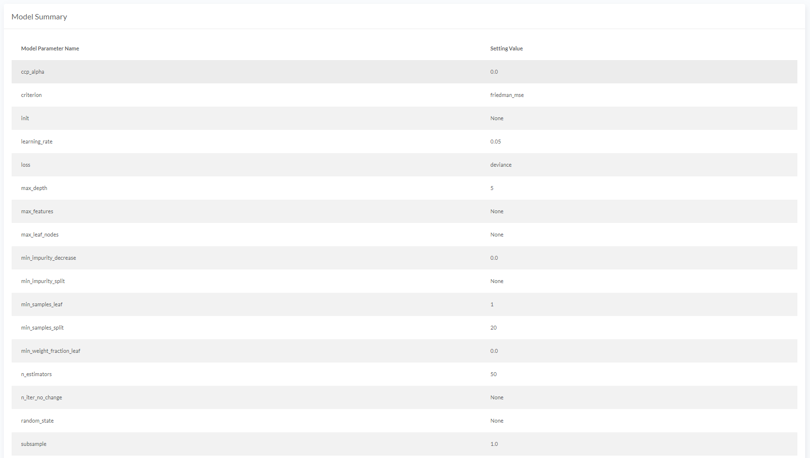
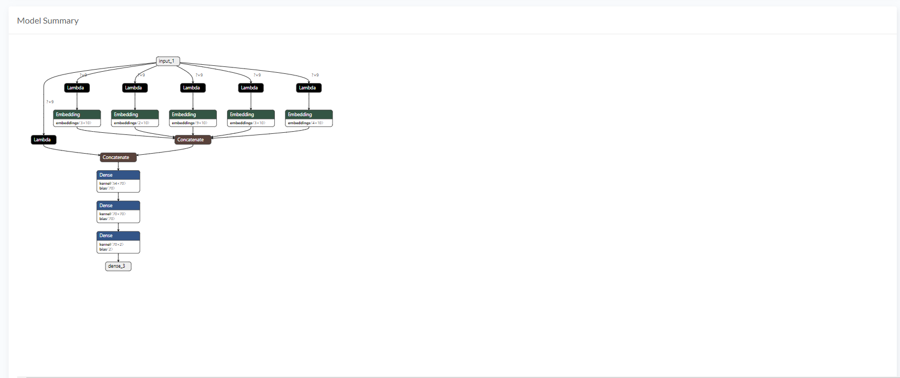

# Model
사용자가 업로드 한 모델에 대한 요약 정보를 제공합니다. kears로 학습된 h5 형태 파일은 시각화 그래프, Scikit-learn으로 학습된 pkl 형태 파일은 모델 파라미터 옵션을 표로 나타냅니다.
  

## Model Summary
* <B>Model Select</B>에서 업로드 된 모델 파일들 중에서 모델 요약을 확인할 파일을 체크박스 형태로 선택합니다.
  

* 선택한 모델을 확인하고 <B>Select</B> 버튼을 누르면 <B>Model Summary</B>에서 모델 요약 정보를 확인할 수 있습니다.
#### Model Summary 예시(pkl)

#### Model Summary 예시(h5)

