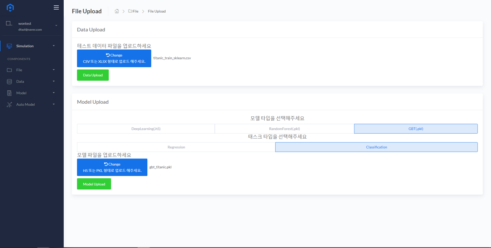
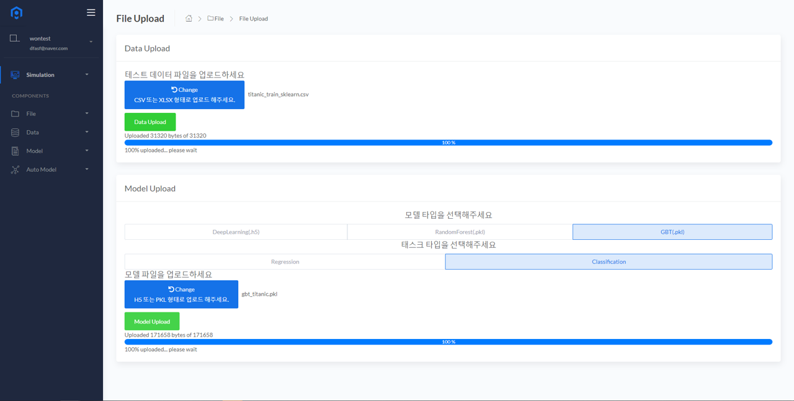
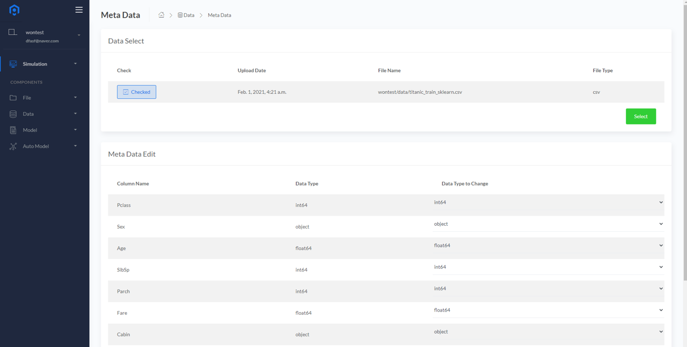
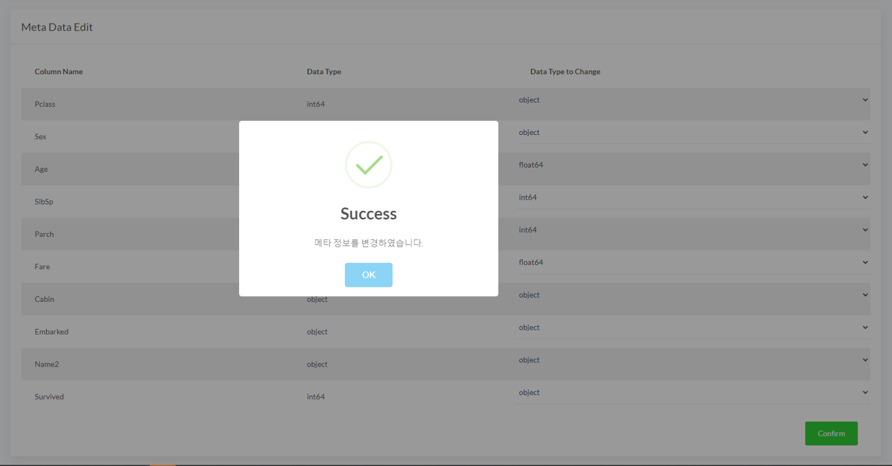
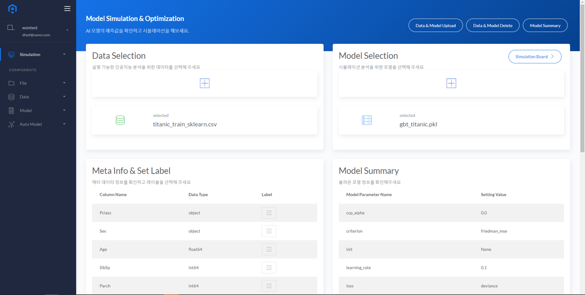
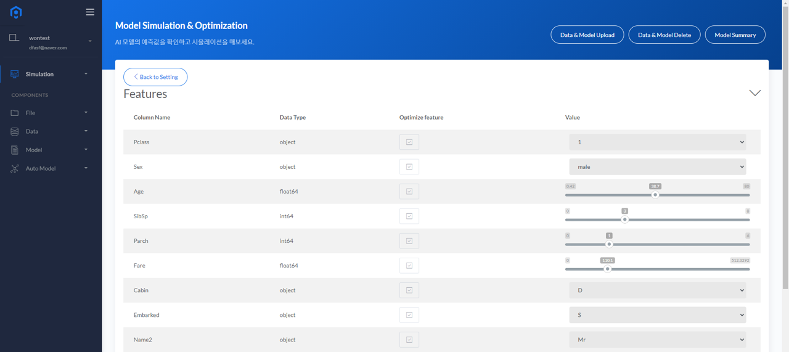
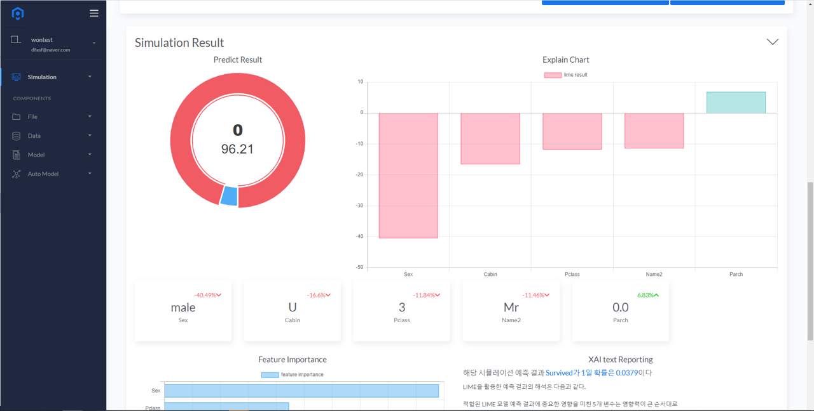
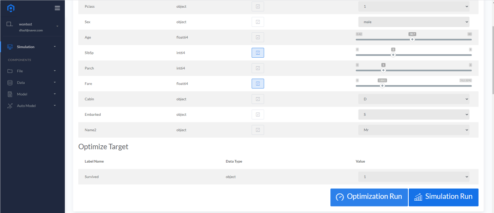
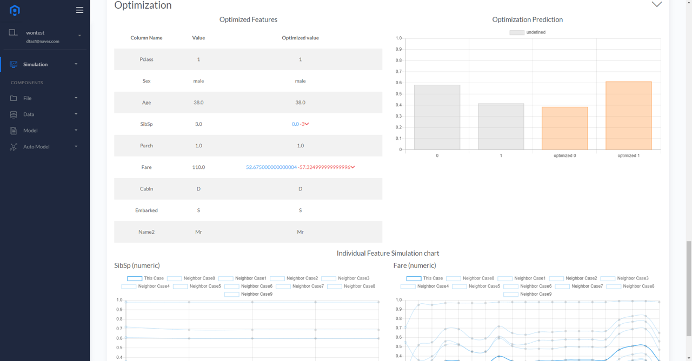

# Python 학습 모델의 BADA 활용

### Python을 활용한 모델링
Colab 환경 학습 예제 링크 : [Titanic Classification 예제](https://colab.research.google.com/drive/1IJeLcjVynhIXyJzmV0mdxcjwtv3id_2O?usp=sharing)

* 본 듀토리얼은 Python 에서 커스텀 모델링 한 것에 대해 BADA Simluation 기능을 적용하는 방법에 대해 설명하고 있습니다.
* 위 예제는 코랩으로 연결되어 있으며 Python에서 Scikit-learn 과 Keras를 사용한 모델링 예제를 설명합니다.
* 예제에서 Numeric 과 Category 변수를 어떤 순서로 처리하는지 유의하여 봐주시기 바랍니다.
* 예제를 완료할 경우 모델 학습에 사용된 데이터셋(.csv)과 학습된 모델 가중치 파일(.h5 또는 .pkl)을 확인할 수 있습니다.
### Python 학습모델 BADA Simulation & Optimization 기능 활용하기
* File Upload를 사용하여 학습 데이터 셋(.csv)과 학습 모델 파일.(h5 또는 .pkl)을 업로드 합니다.
  

  

  
* Python 에서 학습했던것과 동일하게 학습 데이터셋의 Meta Data를 수정합니다.(Object Type의 변수를 확실히 명시하여야 합니다.)
  

  

  
* <B>Simulation & Optimization</B> 메뉴에서 학습 데이터 셋과 학습 모델 파일을 불러옵니다.
  

  
* <B>Simulation Board</B>로 진입하여 변수 값들을 조정하고 예측 결과를 시뮬레이션 합니다.
  

  

* Simulation 결과 위와 같이 0이될 확률이 높게 집계가 되었으며 Optimization Target 1로 두고 최적화를 진행할 변수를 선택할 수 있습니다.
* 최적화를 진행할 변수를 선택하고 <B>Optimization Run</B> 을 누트면 아래와 같은 결과를 확인할 수 있습니다.
  

  

### BADA 실행영상
<iframe width="800" height="400" src="https://www.youtube.com/embed/xB-QxZMhvmo" frameborder="0" 
allow="accelerometer; autoplay; clipboard-write; encrypted-media; gyroscope; picture-in-picture" allowfullscreen></iframe>