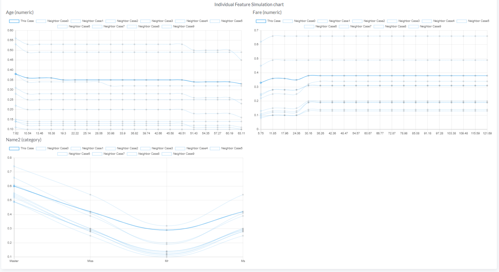

# eXplainable AI(XAI)
BADA 에서는 고도화되고 복잡한 인공지능 모델의 편리하게 실험해 볼 수 있는 Simulation & Optimization 기능을 제공함과 동시에 모델의 해석가능성을
고려하여 예측결과에 대한 신뢰도를 높이고자 합니다.

## 국소적 해석 모델 근사
* 학습된 인공지능 모델에 [Simulation](/simulation/#simulation) 을 적용하여 개별 관측치 예측 결과를 해석하고자 적용된 기술입니다.
* 복잡한 Machine Learning 알고리즘으로 설계된 모델을 전체 데이터 공간에서 해석하는 것은 어렵습니다.
* 그러나, 전체가 아닌 개별 관측치가 존재하는 <B>데이터 내 국소적인 공간</B>에서는 해석 가능한 간단한 모델을 적용해 볼 수 있습니다.
  

  
* 위 그림처럼 설명하고자 하는 관측치를 모델 전체 관점에서는 설명이 어려울수 있으나 관측치가 존재하는 국소 공간(노란색 원)에서는 간단한 직선(점선)으로 설명이 가능합니다.
* 국소적 해석모델을 추정하는 과정은 다음과 같습니다.
      
    

    &nbsp; &nbsp;  사진출처 : [https://christophm.github.io/interpretable-ml-book/lime.html](https://christophm.github.io/interpretable-ml-book/lime.html) 
     

    1. 인공지능 모델로 예측하고자 하는 관심 관측치를 선택합니다.
    2. 데이터 내 분포로 부터 샘플링 된 새로운 데이터 셋을 구축합니다.
    3. 관심 관측치 인근에 있는 샘플 데이터에 좀 더 높은 가중치를 부여합니다.
    4. 가중치가 부여된 샘플들을 활용해 지역적으로 해석 가능한 모델을 학습합니다.
    5. 지역적으로 학습된 해석 가능한 모델로 관심 관측치를 해석합니다.
      

* 지역적(Local)해석 모델 <B><i>&nbsp; g &nbsp;</i></B>는 다음과 같은 손실함수를 최소화 하도록 학습되며 <B><i>&nbsp;f&nbsp;</i></B>는 전체(Global)공간 모델,
<B><i>&nbsp; z &nbsp;</i></B>는 샘플링 된 데이터, <B><i>&nbsp; π &nbsp;</i></B>는 관심 관측치와의 거리를 의미합니다.
* 관심 관측치와 가까운 거리에 있는 샘플 데이터에 대해서 지역적 해석 모델이 잘 학습되도록 설계되어 있습니다.
  

* 지역적 해석 모델 적용시 데이터 내 모든 변수로 설명하는 것은 데이터가 복잡한 경우 효율적이지 않습니다.
* 사용자가 해석하기 용이하도록 <B>예측에 중요한 역할을 한 K개의 변수</B>를 선택하여 리포팅합니다.
 

 

 
* BADA Simulation 에서 제공하는 XAI 리포팅을 통해 예측에 중요하게 관여한 변수별 영향력의 정도, 방향에 대한 간단한 해석을 확인할 수 있습니다.

<!--*지역적(Local)공간 해석 모델을 학습할 때 해석력(Interpretability)와 전체(Global)공간 모델에 대한 충실도(Fidelity)간의 Trade-off 관계를 고려해야합니다.-->
<!--* 따라서, 데이터 내 전체 변수들 중 적절한 수를 선택해 지역 공간 해석모델을 학습하는 것이 중요합니다. -->

## Individual Features Simulation
* [Optimization](/simulation/#optimization) 과정 중 사용자가 지정한 변수 값의 변동이 목표 변수의 변화에 어떤 영향을 미치는지를 보여줍니다.
* 관심 변수 하나를 제외한 나머지 변수 값들은 고정하고 관심 변수의 값을 조금씩 움직여가며 목표 변수의 변화를 Chart 형태로 나타낸 것입니다.
  

 

* Chart 에 나타난 각 선은 하나의 개별 관측치를 의미하며 굵은 선은 Optimization 이 적용된 최적화 관측치를 의미합니다.
* 각 개별 관측치는 최적화 관측치와 데이터 공간상 가까이에 존재하는 것들만 샘플로 추출하여 나타냅니다.
* 데이터 내 최적화 된 관측치 Point 근처에서 사용자가 지정한 변수들이 어떻게 작용하는지를 쉽게 파악할 수 있습니다.
