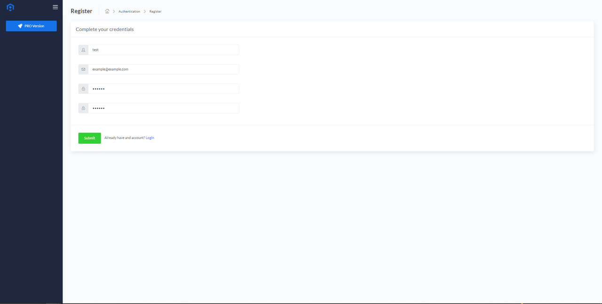
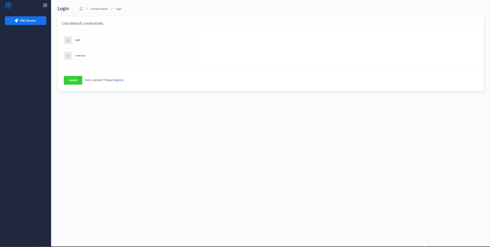
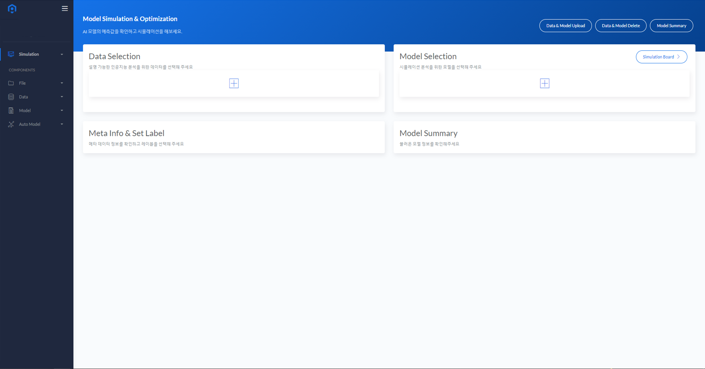

# BADA (Bigwave AI Data Analytics)
<B>BADA(Bigwave AI Data Analytics)</B>는 <a href=http://bigwaveai.com/>BigwaveAI</a>에서 개발한 데이터 분석 솔루션입니다. BADA는 데이터 분석에 대한 지식과 전문적인 인력이
 없어도 자체적으로 분석을 수행할 수 있도록 여러 기능을 제공하고 있습니다. 현재 BADA에서 제공하고 있는 주요 기능은 <B>[시뮬레이션(Simulation)](/simulation/)
 , [최적화(Optimization)](/optimization/), [자동 학습(AutoML)](/AutoModelSelect/)</B>이 있습니다.

* 본 문서는 BADA의 Demo 버젼 사용법과 적용 기술에 대한 간략한 설명이 담긴 문서입니다.
* BADA 다양한 분석 기능들은 <B>Module 형태로 개발</B>되어 솔루션이 적용될 <B>여러 분야 및 도메인의 요구에 따라 효율적으로 분석 기능을 추가할 수 있는 확장성<B>을 가집니다.

## Getting Started
* <B>Register</B> 간단한 절차를 통해 등록을 진행 합니다.
      
    
* <B>Register</B>를 통해 등록된 ID로 <B>Login</B> 합니다.
      
    
* BADA 의 Main Page 입니다.
      
    
