# Simulation & Optimization
<B>Simulation</B> 은 사용하기 쉬운 직관적인 인터페이스로 업로드 된 데이터 및 모델 파일을 활용해 <B>데이터의 값을 변경할 때마다 예측되는 결과를 대시보드 형태로 시각화</B> 해주는 기능입니다.
또한 모델의 예측된 결과에 대해 <B>설명가능한 인공지능(eXplainable AI, XAI)</B>을 적용한 해석을 제공한다.

<B>Optimization</B> 은 목표변수(Label)을 원하는 값으로 근접하기 위해서 사용자가 지정한 변수 값을 어떻게 변경해야 하는지를 찾아주는 최적화 기능입니다.
  
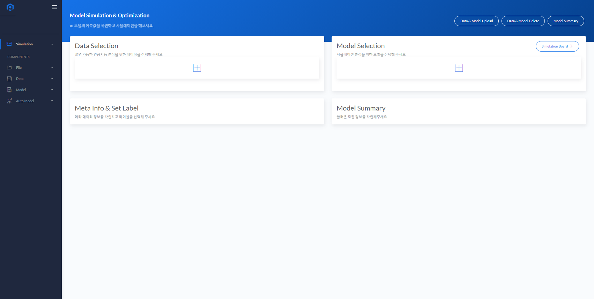

## Simulation
* <B>Data Selection</B>에서 업로드 된 데이터 파일들 중 Simulation을 진행할 모델 파일의 학습에 사용된 데이터 체크박스 형태로 선택합니다.
  
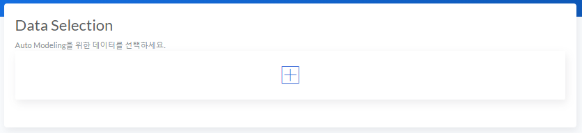
  
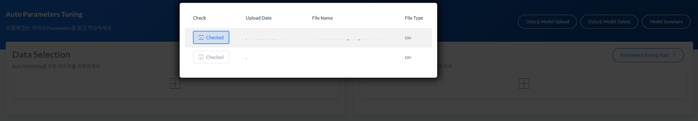
* 데이터에 대해 선택이 완료된 경우 <B>Check Meta Data & Set Label</B> 메타 정보를 확인하고 목표변수(Label)을 선택하여야 합니다.
  
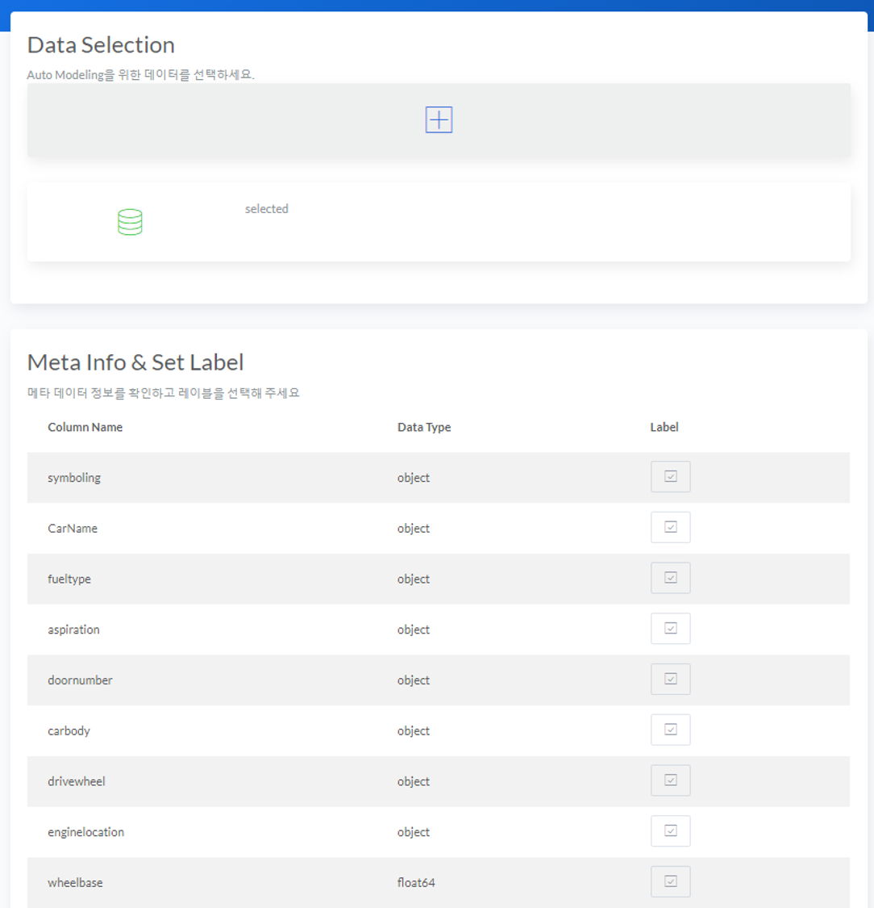
 
* <B>Model Selection</B>에서 업로드 된 모델 파일들 중에서 Simulation 을 수행할 파일을 체크박스 형태로 선택합니다.
  
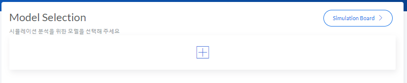
  
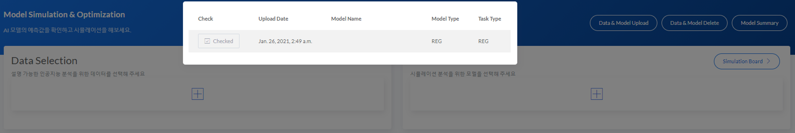

* 모델에 대해 선택이 완료된 경우 <B>Model Summary</B>에서 모델 요약정보를 확인할 수 있습니다.
  
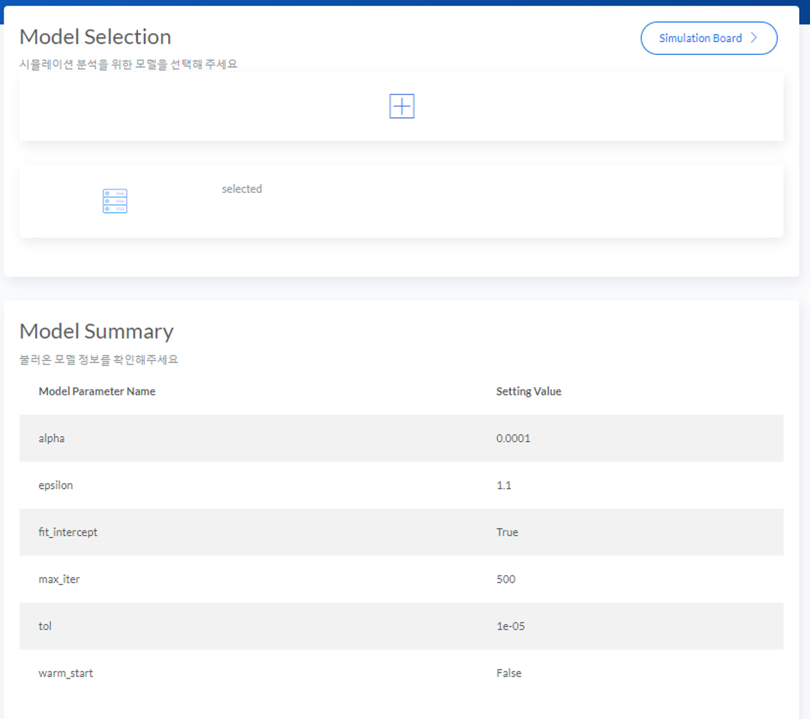

<B>Note : </B> BADA에서 제공되는 Auto Model 학습 기능으로 학습된 것이 아닌 외부(Python)에서 학습한 모델을 활용할 때 [Input Data Processing](/InputDataProcessing/) 내용을 반드시 확인해주세요.

* 데이터, 라벨 및 모델 파일 선택이 완료된 후 <B>Simulation Board</B> 버튼을 누르면 Simulation & Optimization을 위한 대시보드로 화면이 전환됩니다.
  
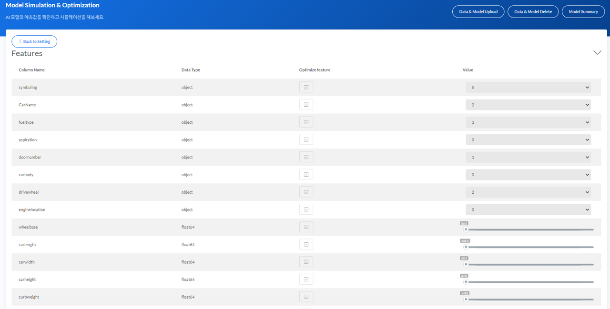
  
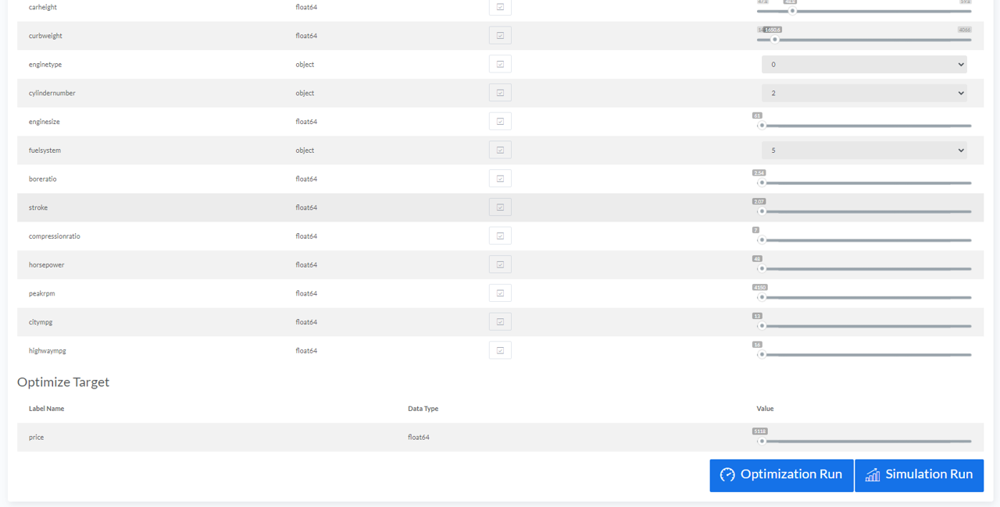
 
* 위 화면에서 데이터 내 변수들을 사용자가 원하는 값으로 조정할 수 있습니다.
* 변수의 형태가 숫자형인지 범주형인지에 따라 각각 Range Slider, Select Box 형태로  값을 변경할 수 있습니다.
* 원하는 변수 값을 변경한 후 그에 따른 예측 결과를 확인하려면 <B>Simulation Run</B> 버튼을 클릭합니다.
  
* Simulation 결과는 아래와 같이 나타나며 Task Type이 Regression 인지 Classification 인지에 따라 각각 목표변수 값 또는 Class에 대한 확률 값으로 예측 결과가 리포팅 됩니다.
  
    A. Regression Report
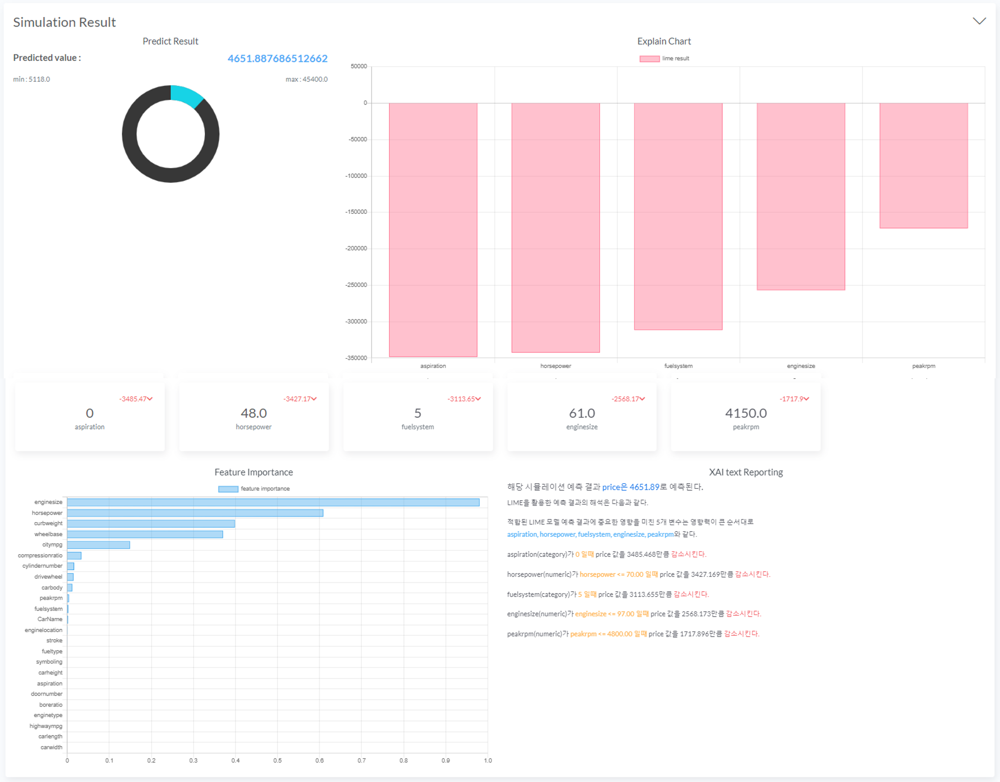
  
    B. Classification Report
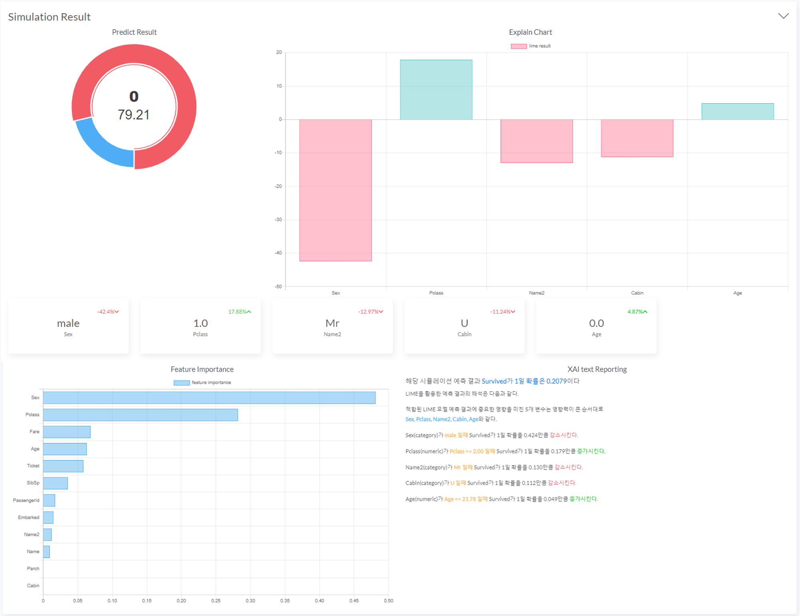
 
* 모델의 예측 결과와 함께 <B>[XAI](/XAI/)</B>가 적용되어 예측 결과에 중요하게 영향을 미친 변수와 영항력의 크기와 방향(양의 효과, 음의 효과)를 확인할 수 있습니다.
* 모델의 전체 변수 중요도도 또한 함께 리포팅 되어 해석을 비교할 수 있습니다.

## Optimization
* 이전 Simulation 과정 중 변수 값을 조정하는 화면에서 최적화를 진행하고 싶은 변수들을 선택할 수 있습니다.
  
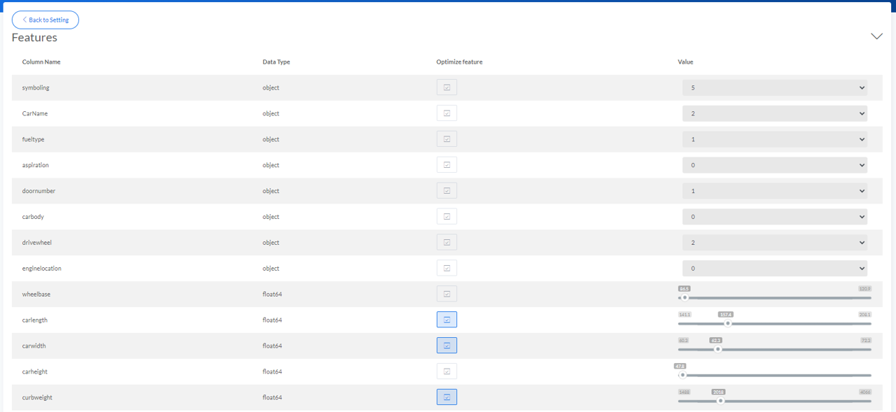
* 최적화를 진행할 변수들을 선택한 후 목표 변수를 어떤 값으로 근사 시키고 싶은지를 선택합니다. Regression 은 목표 변수 값을 Classification 은 목표 변수의 Class를 지정할 수 있습니다.
  
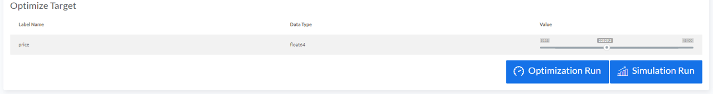
  
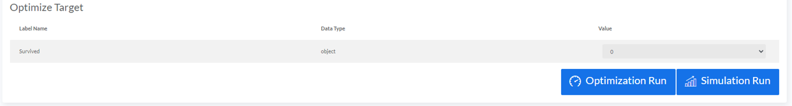

* 위 과정을 완료 후 <B>Optimization Run</B> 버튼을 누르면 Optimization 결과를 확인할 수 있습니다.
* 사용자가 설정한 목표 변수 값에 근사하기 위해 선택한 변수들이 어떻게 변경되었는지를 전후 차이를 확인할 수 있습니다.
* Regression,Classification 의 Task Type에 따라 각각 Optimization 전후 Class의 확률 값, 목표 변수 값의 변화를 나타냅니다.
  
    A. Regression Report
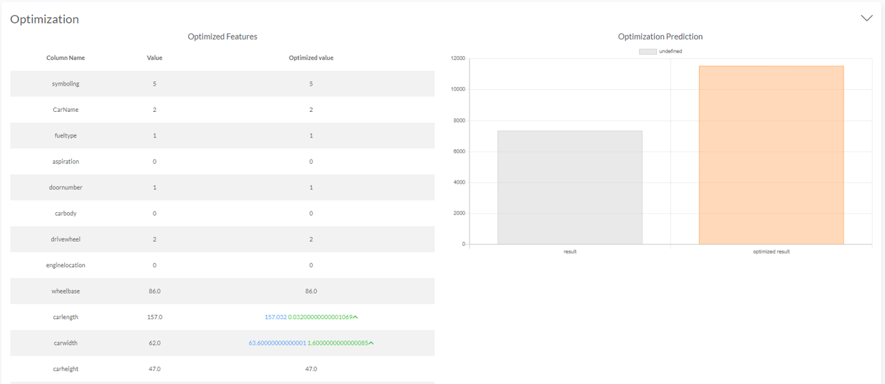
  
    B. Classification Report
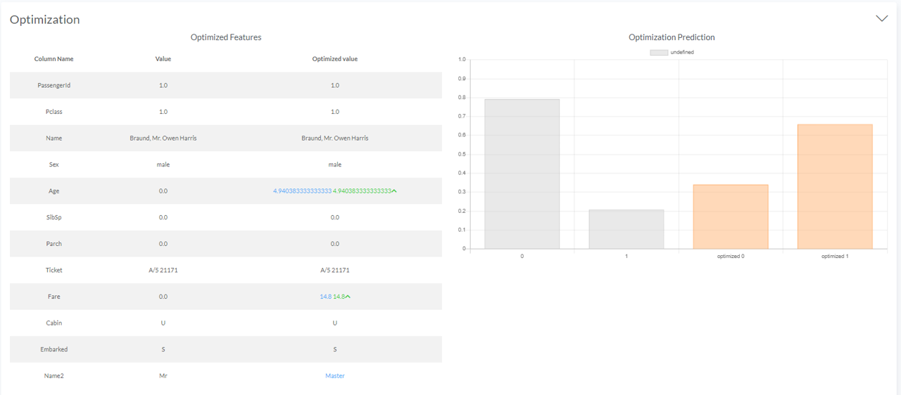

* Optimization 후 리포팅 되는 <B>[Individual Feature Simulation chart](/XAI/#individual-features-simulation)</B>에서는 최적화를 진행한 변수들의 각 값이 변화함에 따라 목표 변수 값(Class의 확률 값)이 어떻게 변화하는지를 나타냅니다.
* 차트 내 각 선들은 학습용 데이터의 샘플들을 의미하며 굵은 선은 모든 선들의 평균 변화를 표현한 것입니다.
  
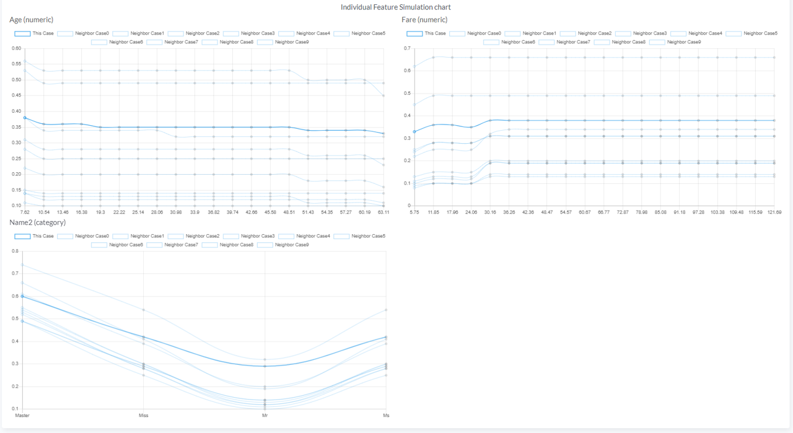
